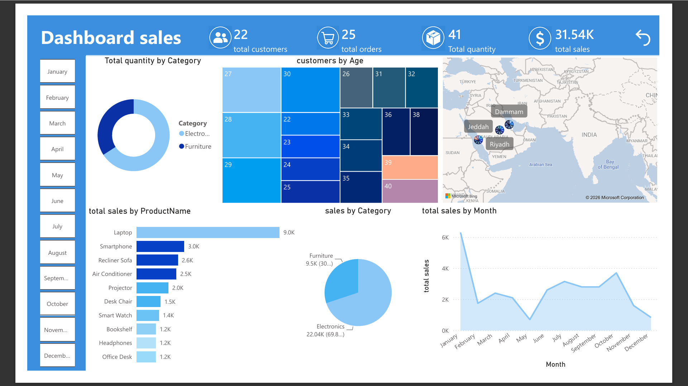

# 📊 Saudi Arabia Sales Dashboard

## 📝 Overview

This project is an interactive **Power BI dashboard** that analyzes sales data across major cities in Saudi Arabia (Riyadh, Jeddah, Dammam).
It provides insights into sales performance, customer distribution, product demand, and monthly trends.

---

## 🎯 Objectives

* Monitor total sales and revenue
* Analyze product performance
* Track customer distribution by age
* Compare sales across cities
* Identify monthly sales trends

---

## 🧰 Tools Used

* Power BI
* Power Query (Data Cleaning)
* DAX (Data Modeling & Measures)

---

## 📸 Dashboard Preview



---

## 📊 Key Insights

* **Total Customers:** 22
* **Total Orders:** 25
* **Total Quantity Sold:** 41
* **Total Sales:** 31.54K

---

## 📈 Dashboard Features

* Sales distribution by **Category (Electronics vs Furniture)**
* Customer segmentation by **Age groups**
* Sales performance by **City (Riyadh, Jeddah, Dammam)**
* Top-selling products (Laptop, Smartphone, etc.)
* Monthly sales trend visualization

---

## 🗂️ Visualizations Included

* Donut Chart (Category Distribution)
* Bar Chart (Top Products)
* Line Chart (Monthly Sales)
* Map Visualization (City Sales)
* KPI Cards (Summary Metrics)

---

## 📂 Project Structure

```id="2g7nxa"
📁 project
 ┣ 📁 screenshots
 ┣ 📄 Saudi Sales Dashboard.pbix
 ┗ 📄 README.md
```

---

## ▶️ How to Use

1. Download the `.pbix` file
2. Open using Power BI Desktop
3. Interact with filters (Months on the left panel)
4. Explore insights across visuals

---

## 📌 Notes

* Data can be filtered by month using the sidebar
* Dashboard is designed for demonstration and learning purposes

---

# 📊 لوحة مبيعات المملكة العربية السعودية

## 📝 نظرة عامة

هذا المشروع عبارة عن لوحة تحكم تفاعلية باستخدام **Power BI** لتحليل بيانات المبيعات في مدن رئيسية داخل المملكة (الرياض، جدة، الدمام).
يعرض المشروع مؤشرات الأداء، توزيع العملاء، وتحليل المنتجات والاتجاهات الزمنية.

---

## 🎯 أهداف المشروع

* متابعة إجمالي المبيعات
* تحليل أداء المنتجات
* توزيع العملاء حسب العمر
* مقارنة المبيعات بين المدن
* تحليل المبيعات الشهرية

---

## 🧰 الأدوات المستخدمة

* Power BI
* Power Query (تنظيف البيانات)
* DAX (النمذجة والتحليل)

---

## 📸 صورة من الداشبورد


---

## 📊 أهم المؤشرات

* عدد العملاء: 22
* عدد الطلبات: 25
* إجمالي الكمية: 41
* إجمالي المبيعات: 31.54K

---

## 📈 مميزات الداشبورد

* توزيع المبيعات حسب الفئة (إلكترونيات / أثاث)
* تحليل العملاء حسب العمر
* عرض المبيعات حسب المدن
* أفضل المنتجات مبيعًا
* تحليل المبيعات حسب الأشهر

---

## 🗂️ الرسوم المستخدمة

* مخطط دائري (الفئات)
* مخطط أعمدة (المنتجات)
* مخطط خطي (المبيعات الشهرية)
* خريطة (المدن)
* بطاقات مؤشرات (KPIs)

---

## ▶️ طريقة الاستخدام

1. تحميل الملف
2. فتحه باستخدام Power BI
3. استخدام الفلاتر (الأشهر)
4. استكشاف البيانات

---

## 📌 ملاحظات

* يمكن تصفية البيانات حسب الشهر من القائمة الجانبية
* المشروع لغرض التعلم والتحليل

---
